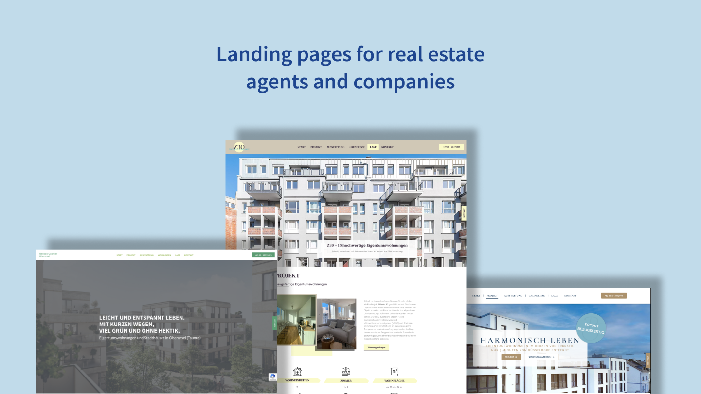

## Summary
---
Since working for my first full-time job in an agency-like environment, I have created several landing pages for real estate agents and companies. I planned the structure, design (color palette, fonts, etc.), and vibe of every website with the information and material given by clients. My daily tools were WordPress, Elementor Pro, Photoshop, and Illustrator.

**Days until completion:** 3-7 workdays

**Methods:** Brainstorming, Prototyping

## Context
---
The corporation I've worked at is a tech company specializing in real estate. Thus, all my web pages are similarly structured with repetitive patterns. All those designs are made as user-friendly, mobile- and conversion-optimized as possible.  
I mostly used the website builder Elementor, but I frequently did adjustments with HTML and CSS as well.

## Process
---
Because of the strict time frame to create the first draft for the customer, I built the website with a minimal design template which included metadata and the basic structure. By studying the given information and understanding what kind of product needed to be marketed, I started to construct my design by sorting out text and media material and aligning them in a way, that is comprehensive and reasonable for users. After that, my website was reviewed internally by colleagues who checked grammar and spelling, (design) inconsistencies, and other flaws that might have been overlooked. Only after that, the draft is sent to the customer who will eventually make further remarks on the website before giving the green light to go live with it. 

Mobile optimization came in later when the customer was satisfied with the overall look, feel, and content of the web page.

**TL;DR**  
Studying material of the customer > Building the landing page according to that > Internal feedback loop > Customer feedback loop > Mobile optimization after greenlight from customer > If necessary, further adjustments to the website

## Outcome
---
My landing page designs can be viewed in the image carousel below:


../assets/WorkSamples/Beethoven.png
../assets/WorkSamples/Levio.png
../assets/WorkSamples/Z30.png
../assets/WorkSamples/Teichwiesen.png



For a closer look at these designs, please click the following links:

[Design 1](../assets/WorkSamples/Beethoven.png){:target="_blank"}  ● 
[Design 2](../assets/WorkSamples/Levio.png){:target="_blank"} ● 
[Design 3](../assets/WorkSamples/Z30.png){:target="_blank"} ● 
[Design 4](../assets/WorkSamples/Teichwiesen.png){:target="_blank"}

## Retrospective and Improvements
---
Looking back at my first designs as a visual designer with much more responsibilities than in my previous jobs, I learned a lot in terms of how to communicate clearly with customer managers, which questions to ask and which are relevant going forward, how and what to prioritize, and working on a time constraint.

(Almost) everything I learned also has the potential to improve my ongoing career. Making clear and more reasonable (design) decisions are one of the examples that I will work on to justify my (design) choices.