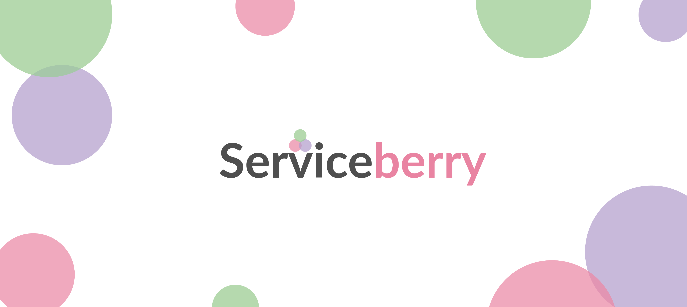
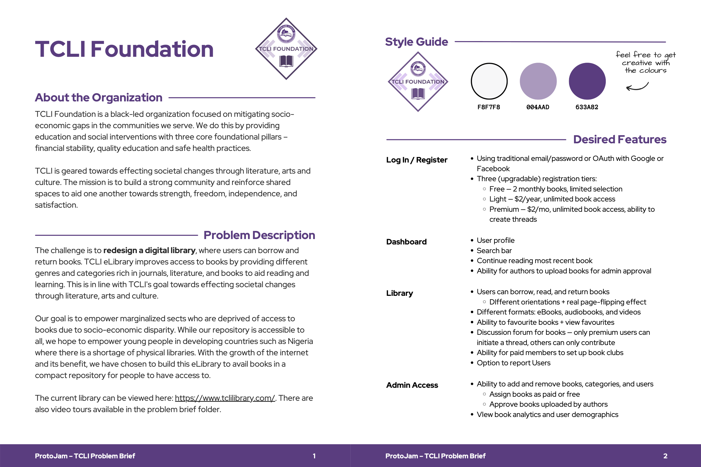
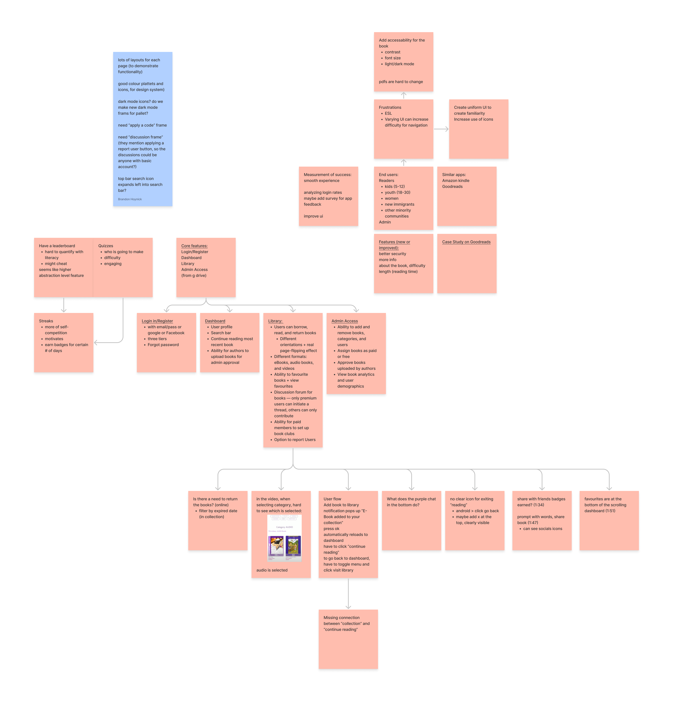
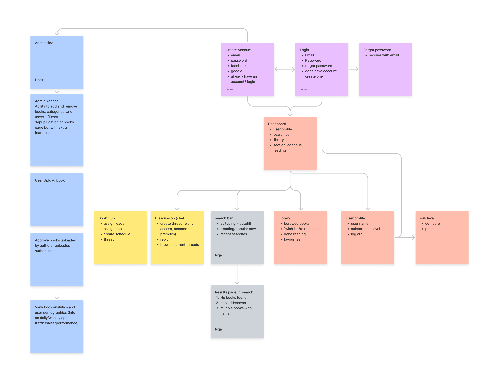

## Summary
---

In February 2022, I participated in a virtual UX/UI Designathon promoting *technology for good* held by Ada’s team of University of Alberta (Edmonton, Canada). Unlike traditional hackathons, a designathon (or design hackathon) is a no-code design competition in which participants compete in UX/UI design challenges.

I was heavily involved in the UI process: coming up with a design system (color palette, fonts, etc.), wireframing, and prototyping.

**Duration:** 1 weekend (February 25-27)

**Methods:** Design Thinking, Brainstorming, Wireframing, Prototyping

## The Challenge
---
“Technology for good” was the theme for this year. The design competitions are focused around causes for local non-profit organizations because they want to empower young minds to use their skills for social change.

There were three challenges given and our team of five decided to **redesign a digital library** of the TCLI Foundation.

## The Problem
---
We were given a problem brief (see below) for our challenge and tried to incorporate as many desired features as possible: **Log In/Register, Dashboard, Library, and Admin Access.**

## Day 1: Research, Define
---
Our team consisted of 3 members from North America and 2 from Europe, creating a 7-8 hour difference between us. In order for us to participate in the hackathon, we had to register our team with a team name that represents us. “UXbusters” was the team name we chose.

Since we were given a problem brief, we did not spent much time on discussing what to create. Using the design thinking method, each of us conducted research using material provided by the organizers and gradually became familiarized with the product and the difficulties we were attempting to tackle.

Given the time difference, the North American part of the team brainstormed and started to define the problems and tasks in a FigJam document. We chose this platform because of its simple-to-use interface, different tools (FigJam and Figma), and the collaboration function.

[Link to the file](https://www.figma.com/file/xidOYYvNfcchLMPbiisNb9/Brainstorming-ProtoJam?node-id=0%3A1){:target="_blank"}

## Day 2: Define, Ideate
---
The second day (and also the only full day we had) I spent catching up on workshops that I could not attend due to the time difference. 

We used FigJam to create a user flow diagram and assigned responsibilities to wireframe our initial low-fidelity prototypes in Figma during our meetings. In Figma, I also started building a design system and improve on the one that was already given.

[Link to the file](https://www.figma.com/file/IZbzbKXnqXkRSqk1KCFRqf/User-Flow?node-id=0%3A1){:target="_blank"}

## Day 3: Prototype
---
On our last day, we quickly did wireframes before transforming them into prototypes. Due to the time difference, we could not work on the challenge simultaneously which caused some inconsistencies. But we tried to keep the designs steady and fulfill all the requirements. With a little extra time on our hand, some of us incorporated a few extra functions. After submitting our work to Ada‘s team, we could only wait for the results.



The designs can be viewed in detail [here](https://www.figma.com/file/qe6XXHLXt3xlOWX9r0gnI7/UXbusters-ProtoJam-Design?node-id=7%3A2).

## Retrospective
---

### Conclusion

This was my first ever hackathon of any sorts - very exciting but also challenging as well. It was fun to collaborate with strangers from around the world on a topic on such a short time frame and to see what results we will achieve. Even though our team didn’t win (not the goal but would’ve been nice nonetheless), I was able to learn a lot and I am very grateful to gain such an experience.

### Challenges

The time factor most definitely was the biggest challenge. To create a whole new design within just 48 hours on top of a time difference of up to 8 hours was ambitious. Further, since we were five team members, we had to come to terms with one decision for everything. Coordinating different opinions in such a small time frame called for quick decision making and compromises. Also, not everyone was on the same UX maturity level, which meant that some processes needed to be discussed and explained more.

### Improvements

Communication is an aspect that can be improved (from all sides). I think an assigned leader who allocates tasks and makes suggestions on how to proceed further, would’ve been a great asset to our team.  
Also, with a little better time management I would’ve loved to build a clickdummy with our design to gain a better insight to our prototype for people who are not familiar with it.

The whole Figma file can be viewed [here](https://www.figma.com/file/qe6XXHLXt3xlOWX9r0gnI7/UXbusters-ProtoJam-Design?node-id=7%3A2](https://www.figma.com/file/qe6XXHLXt3xlOWX9r0gnI7/UXbusters-ProtoJam-Design?node-id=7%3A2).