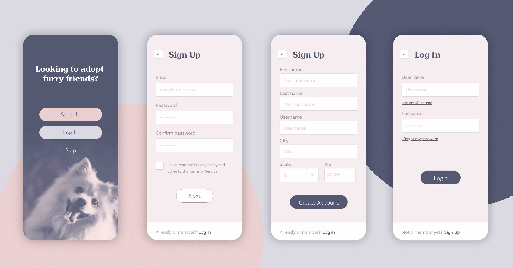
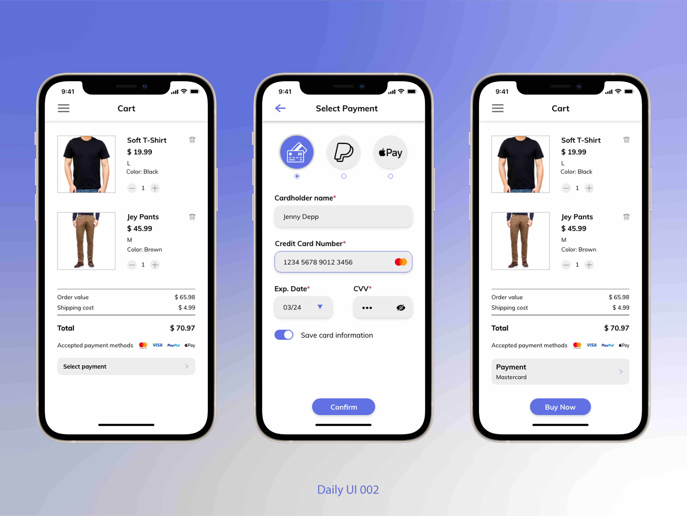
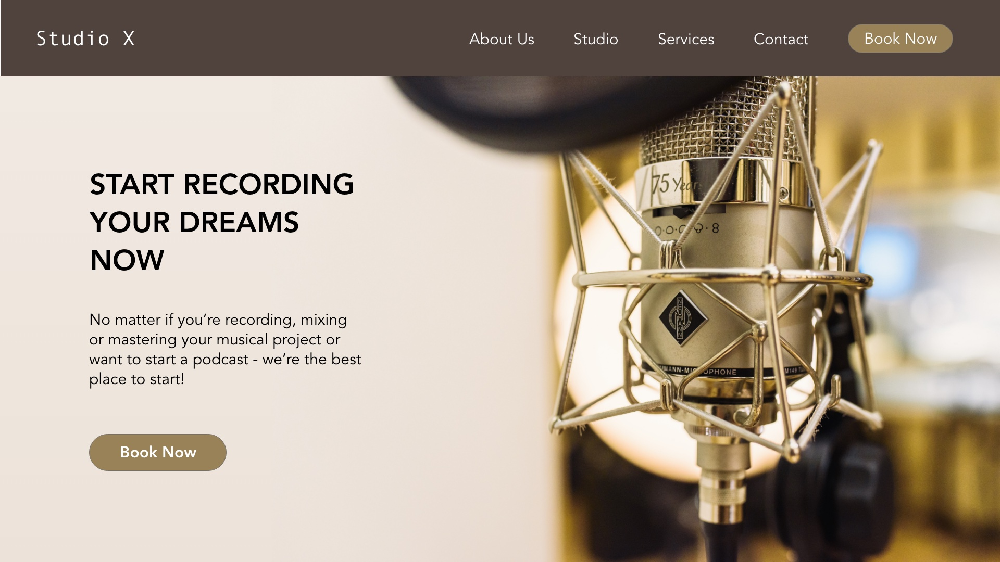
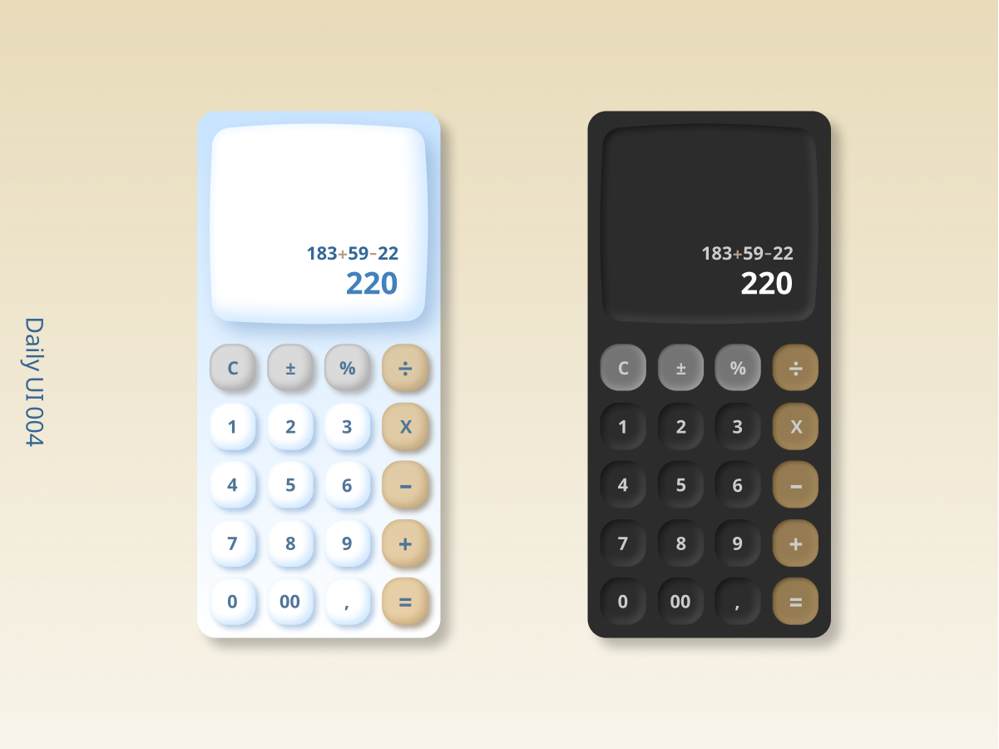
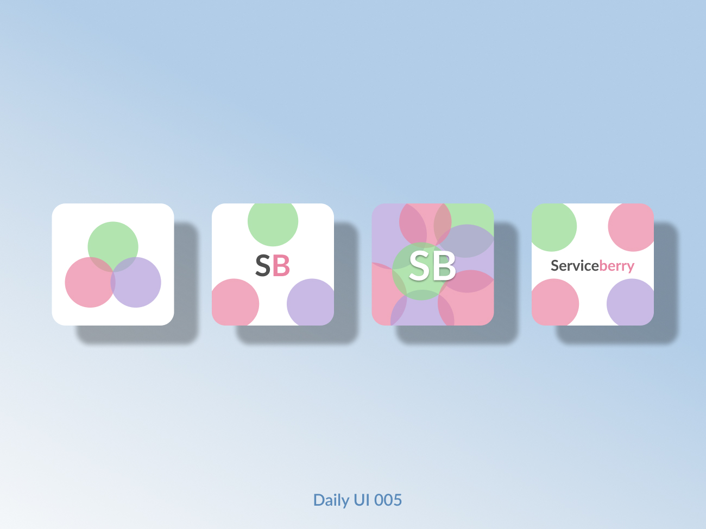
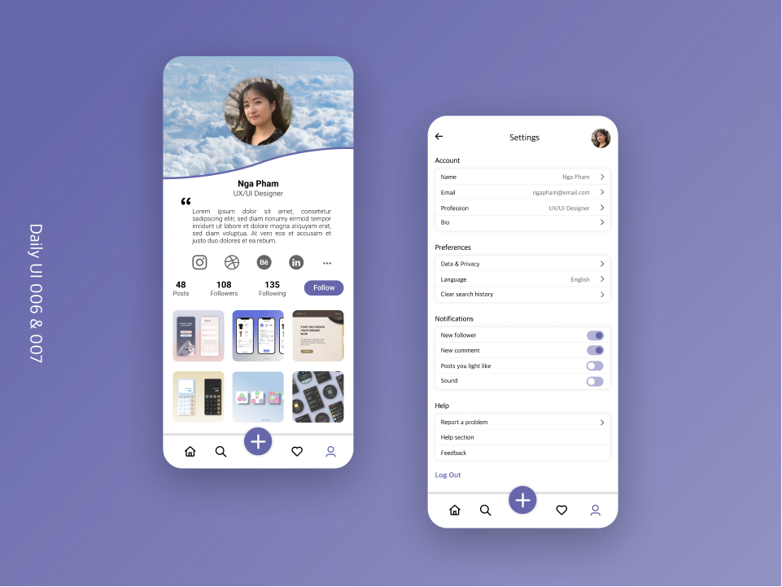

## Designs

<!--  
<figure>
  
  <figcaption style="text-align: center; color: #6c757d;">Mobile screen design of a pet adoption app</figcaption>
</figure>
-->

**What:** Mobile screen design of a pet adoption app

**Why:** As part of the #DailyUI Challenge, this was challenge 001 of 100 to create a sign up page

**How:** Adobe XD using a [UI Kit](https://www.behance.net/gallery/62932019/Pawtastic-UI-Kit-for-Adobe-XD) by Meagan Fisher; view the prototype in more detail [here](https://xd.adobe.com/view/fdc58c32-f702-4884-bba4-3dd1b8906e9e-a896/)

---

**What:** Mobile screen design of a cart checkout of a clothing shop

**Why:** As part of the #DailyUI Challenge, this was challenge 002 of 100 to create a credit card checkout

**How:** Adobe XD; view the prototype in more detail [here](https://xd.adobe.com/view/e8308e2c-3e1f-4e9b-8703-7defe30ff5e9-bd63/)

---

**What:** Desktop landing page of a recording studio

**Why:** As part of the #DailyUI Challenge, this was challenge 003 of 100 to create a landing page

**How:** Adobe XD, [Image credit](https://unsplash.com/photos/PfdyEAD213o)

---

**What:** Mobile screen design of a calculator in light and dark mode in my attempt at [claymorphism](https://hype4.academy/articles/design/claymorphism-in-user-interfaces)

**Why:** As part of the #DailyUI Challenge, this was challenge 004 of 100 to create a calculator

**How:** Figma

---

**What:** App icons for *Serviceberry* (one of my projects, view it [here](https://pttn27.github.io/portfolio/projects/serviceberry-project))

**Why:** As part of the #DailyUI Challenge, this was challenge 005 of 100 to create an app icon

**How:** Figma

---

**What:** Mobile screen design of user profile in a social networking platform to showcase and discover creative work + settings of the user profile

**Why:** As part of the #DailyUI Challenge, this was challenge 006 and 007 of 100 to create a user profile and settings

**How:** Figma